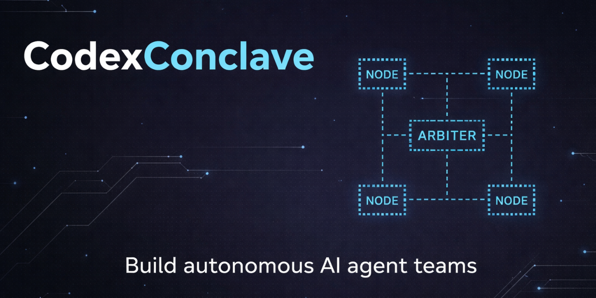
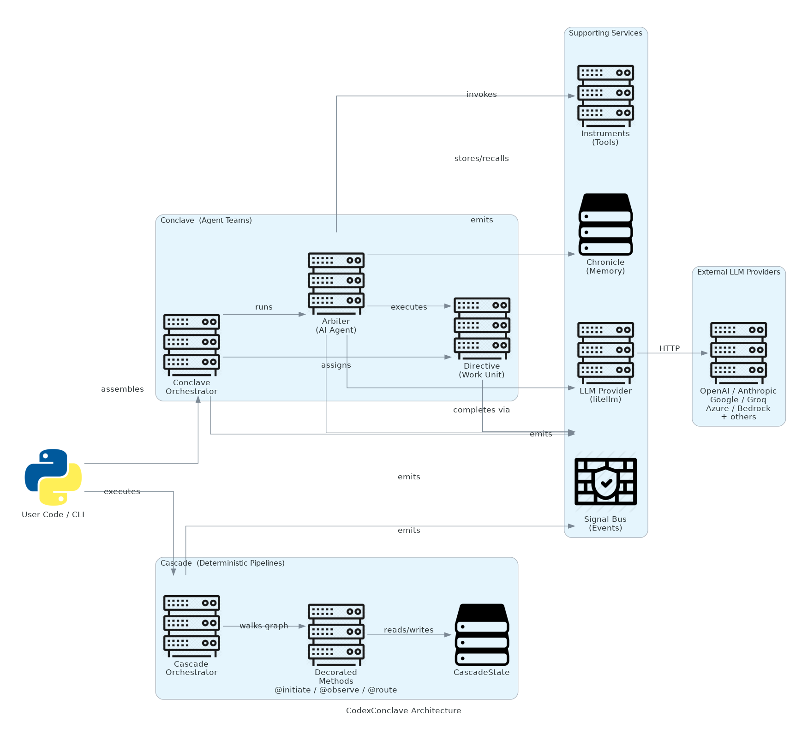

<p align="center"></p>

<h1 align="center">CodexConclave</h1>
<p align="center">A Python framework for building and orchestrating teams of autonomous AI agents</p>

<p align="center">
  
  
  
  
  <a href="LICENSE"></a>
</p>

---

**Navigation**

- [What it does](#what-it-does)
- [Architecture](#architecture)
- [Installation](#installation)
- [Quick Start](#quick-start)
- [CLI Reference](#cli-reference)
- [Configuration](#configuration)
- [Design Decisions](#design-decisions)
- [Observability](#observability)
- [Known Limitations](#known-limitations)
- [Contributing](#contributing)
- [License](#license)

---

## What it does

CodexConclave gives you two distinct paradigms for building AI workflows:

**Conclave** -- team of autonomous agents (Arbiters) collaborating on a list of work units (Directives). Each Arbiter has its own role, objective, and toolset. Arbiters reason iteratively using an LLM, call instruments (tools), delegate to peers, and chain their outputs into a final result. Use this when you want open-ended reasoning where the agents decide how to get the work done.

**Cascade** -- deterministic, decorator-driven pipeline where you control the execution graph. Methods decorated with `@initiate`, `@observe`, and `@route` wire themselves into a dependency graph that is walked at runtime. No LLM involvement in the orchestration itself -- pure Python with typed state flowing between stages. Use this when the shape of the workflow is known in advance.

Both models emit structured events through a shared Signal Bus, support pluggable memory backends, and integrate with any LLM provider that litellm supports.

---

## Architecture

<p align="center"></p>

**Conclave path** -- User code assembles Arbiters and Directives into a Conclave, selects `sequential` or `hierarchical` protocol, and calls `.assemble()`. Each Directive is executed by its assigned Arbiter, which drives an iterative LLM loop: build messages, call the LLM Provider (backed by litellm), parse instrument calls or delegation requests, invoke the appropriate Instrument or peer Arbiter, append results to the message thread, and repeat until the Arbiter produces a final answer or exhausts its iteration budget.

**Cascade path** -- User code subclasses `Cascade`, decorates methods, and calls `.execute()`. The framework introspects the class at definition time to build a dependency graph. At runtime it calls `@initiate` methods first, then fans out to `@observe` listeners, routing branches via `@route` return values.

**Supporting infrastructure** spans both paths: the LLM Provider abstracts provider-specific APIs behind a unified interface; Instruments are validated, cached, and use-limited tools that Arbiters can invoke; Chronicle stores and retrieves memories per Arbiter; the Signal Bus is a thread-safe singleton that any component can emit to and any listener can subscribe to.

---

## Installation

```bash
pip install codexconclave
```

Optional extras:

```bash
# Persistent vector memory with LanceDB and sentence-transformers
pip install "codexconclave[memory]"

# Knowledge base support with ChromaDB and fastembed
pip install "codexconclave[knowledge]"

# All optional dependencies
pip install "codexconclave[all]"

# Development tools (pytest, mypy, ruff, pre-commit)
pip install "codexconclave[dev]"
```

At least one LLM provider API key must be set in the environment. See [Configuration](#configuration).

---

## Quick Start

### Conclave -- agent team

```python
from codexconclave import Arbiter, Conclave, Directive, Protocol
from codexconclave.llm import LLMProvider

llm = LLMProvider(model="gpt-4o")

researcher = Arbiter(
    role="Researcher",
    objective="Find accurate, up-to-date information on the given topic.",
    llm=llm,
)

writer = Arbiter(
    role="Writer",
    objective="Turn research notes into clear, engaging prose.",
    llm=llm,
)

research = Directive(
    description="Research the history of transformer neural networks.",
    expected_output="Bullet-point notes covering key milestones and papers.",
    arbiter=researcher,
)

article = Directive(
    description="Write a short article based on the research notes.",
    expected_output="A 300-word article suitable for a developer blog.",
    arbiter=writer,
    context=[research],       # automatically receives researcher output
)

conclave = Conclave(
    arbiters=[researcher, writer],
    directives=[research, article],
    protocol=Protocol.sequential,
)

result = conclave.assemble()
print(result.final_output)
```

### Cascade -- deterministic pipeline

```python
from codexconclave.cascade import Cascade, CascadeState, initiate, observe, route

class AnalysisPipeline(Cascade):

    @initiate
    def load_data(self) -> str:
        return "raw,csv,data"

    @observe("load_data")
    def clean(self, raw: str) -> str:
        return raw.replace(",", " | ")

    @observe("clean")
    def analyse(self, cleaned: str) -> dict:
        words = cleaned.split(" | ")
        return {"count": len(words), "sample": words[:2]}

    @route
    @observe("analyse")
    def dispatch(self, report: dict) -> str:
        return "summarise" if report["count"] > 1 else "skip"

    @observe("dispatch")
    def summarise(self, report: dict) -> str:
        return f"Found {report['count']} items."

pipeline = AnalysisPipeline()
result = pipeline.execute()
print(result.final_state)
```

### Custom instruments (tools)

```python
from codexconclave.instruments import StructuredInstrument

def search_web(query: str) -> str:
    # your implementation
    return f"Results for: {query}"

search = StructuredInstrument.from_function(
    search_web,
    name="search_web",
    description="Search the web for current information.",
)

researcher = Arbiter(
    role="Researcher",
    objective="...",
    llm=llm,
    instruments=[search],
)
```

### Event listeners

```python
from codexconclave.signals import SignalBus, BaseSignalListener
from codexconclave.signals.types import DirectiveCompletedSignal

class AuditLogger(BaseSignalListener):
    def accepts(self, signal) -> bool:
        return isinstance(signal, DirectiveCompletedSignal)

    def handle(self, signal) -> None:
        print(f"[AUDIT] directive done in {signal.execution_time_ms:.0f}ms")

SignalBus.instance().register(AuditLogger())
```

---

## CLI Reference

The `codex` command scaffolds and runs projects.

```
Usage: codex [OPTIONS] COMMAND [ARGS]...

Commands:
  create conclave <name>   Scaffold a new Conclave agent-team project
  create cascade  <name>   Scaffold a new Cascade pipeline project
  run                      Execute the current project's main.py
  chat <query>             Start an interactive chat session
```

### Examples

```bash
# Scaffold a new agent project
codex create conclave my-research-team
cd my-research-team
# edit main.py, then:
codex run

# Scaffold a pipeline
codex create cascade my-pipeline
cd my-pipeline
codex run

# One-shot chat
codex chat "Summarise the key ideas in the attached document."
```

---

## Configuration

All configuration is via environment variables. A `.env` file in the working directory is loaded automatically.

### LLM provider keys

| Variable | Provider |
|---|---|
| `OPENAI_API_KEY` | OpenAI |
| `ANTHROPIC_API_KEY` | Anthropic Claude |
| `GOOGLE_API_KEY` | Google Gemini |
| `GROQ_API_KEY` | Groq |
| `MISTRAL_API_KEY` | Mistral |
| `AZURE_API_KEY` | Azure OpenAI |
| `AZURE_API_BASE` | Azure endpoint URL |
| `AZURE_API_VERSION` | Azure API version |
| `AWS_ACCESS_KEY_ID` | AWS Bedrock |
| `AWS_SECRET_ACCESS_KEY` | AWS Bedrock |
| `AWS_DEFAULT_REGION` | AWS Bedrock region |

### Framework settings

| Variable | Default | Description |
|---|---|---|
| `CODEX_LOG_LEVEL` | `INFO` | Log verbosity (`DEBUG`, `INFO`, `WARNING`, `ERROR`, `CRITICAL`) |
| `CODEX_MEMORY_BACKEND` | `memory` | Memory store: `memory` (in-process) or `lancedb` (persistent) |
| `CODEX_MEMORY_PATH` | | Path for LanceDB data directory |
| `OTEL_SDK_DISABLED` | `false` | Set to `true` to disable telemetry |
| `OTEL_SERVICE_NAME` | `codexconclave` | Service name in telemetry traces |
| `OTEL_EXPORTER_OTLP_ENDPOINT` | | Custom OpenTelemetry collector endpoint |

### LLMProvider constructor

LLM settings can also be set per-provider instance:

```python
LLMProvider(
    model="claude-3-5-sonnet-20241022",  # exact litellm model identifier
    temperature=0.7,
    max_tokens=4096,
    api_key="sk-...",        # overrides env var
    base_url="http://...",   # custom endpoint (e.g. local Ollama)
    timeout=600.0,
    max_retries=3,
    streaming=False,
)
```

Model names must be exact litellm identifiers (e.g., `gpt-4o`, `claude-3-5-sonnet-20241022`, `gemini/gemini-1.5-pro`). See the [litellm documentation](https://docs.litellm.ai/docs/providers) for the full list.

---

## Design Decisions

**Introspection-based Cascade graph.** Cascade subclasses use `__init_subclass__` to inspect decorated methods at class definition time, building `_initiate_methods`, `_observe_map`, and `_route_methods` registries. This keeps the user API clean (decorators only) while making the dependency graph computable without a separate registration step.

**JSON parsing for Arbiter tool calls.** Arbiters detect instrument invocations by scanning LLM responses for `{"instrument": "name", "arguments": {...}}` JSON fragments, rather than relying on the provider's native function-calling API. This makes tool use work uniformly across all litellm-supported providers, including those without native tool schemas.

**Stacked retry strategy.** Retries exist at two levels: `LLMProvider` retries individual API calls with exponential backoff; `Conclave` retries entire directive executions. This catches transient network failures at the call level and model-quality failures at the task level independently.

**Pydantic v2 throughout, with `arbitrary_types_allowed`.** All framework models use `ConfigDict(arbitrary_types_allowed=True)` to hold non-serializable fields (LLM provider instances, callables, Pydantic model classes) while still getting validation and IDE support on everything else.

**ContextVar-backed SignalBus.** The SignalBus is a process-level singleton but uses `contextvars.ContextVar` to allow per-execution-context buses in concurrent or async scenarios. Listeners registered on the context bus only see signals from their own execution context.

---

## Observability

**Signal Bus** -- every major lifecycle event emits a typed, immutable Pydantic signal. All signals carry a UUID, ISO timestamp, and relevant metadata.

| Signal | Emitted when |
|---|---|
| `ConclaveStartedSignal` / `ConclaveCompletedSignal` / `ConclaveErrorSignal` | Conclave run begins, ends, or fails |
| `DirectiveStartedSignal` / `DirectiveCompletedSignal` / `DirectiveErrorSignal` | Each directive begins, ends, or fails |
| `ArbiterStartedSignal` / `ArbiterCompletedSignal` / `ArbiterErrorSignal` | Each Arbiter execution begins, ends, or fails |
| `InstrumentUsedSignal` | An instrument is invoked |
| `LLMCallSignal` | An LLM call completes (includes token counts and latency) |
| `CascadeStartedSignal` / `CascadeCompletedSignal` | Cascade pipeline begins or ends |

Subscribe by subclassing `BaseSignalListener` and registering it with `SignalBus.instance().register(listener)`.

**OpenTelemetry** -- the framework ships an optional OTLP HTTP exporter. Set `OTEL_EXPORTER_OTLP_ENDPOINT` to your collector. Disable entirely with `OTEL_SDK_DISABLED=true`. Telemetry is anonymous and collects only aggregate usage metrics (model names, execution times, error rates).

---

## Known Limitations

**Async execution is partially implemented.** `Conclave.aassemble()` exists but runs the synchronous path inside `loop.run_in_executor()`. The `Directive.async_execution` flag is declared but has no effect. Cascade is fully synchronous. True parallel directive execution is not yet supported.

**Knowledge sources are not wired.** `Conclave` accepts a `knowledge_sources` parameter, but the value is never used in the current execution path. It is a placeholder for a planned RAG integration.

**Context growth is unbounded.** Directive outputs are concatenated into a running context string. There is no automatic summarisation or truncation. Long chains of directives will eventually hit the model's context window.

**Instrument JSON parsing is fragile.** The Arbiter extracts tool calls by finding the first `{...}` block in the LLM response. If the response contains multiple JSON objects or nested braces that confuse the parser, the call will be silently treated as a final answer.

**Default memory is in-process and non-persistent.** `InMemoryChronicleStore` (the default) is lost when the process exits and uses substring matching rather than semantic similarity. Install `codexconclave[memory]` and set `CODEX_MEMORY_BACKEND=lancedb` for production use.

**Telemetry is on by default.** Anonymous usage telemetry is sent to `telemetry.codexconclave.ai` unless `OTEL_SDK_DISABLED=true` is set.

---

## Contributing

See [CONTRIBUTING.md](CONTRIBUTING.md) for the full guide. Quick version:

```bash
# Clone and install dev dependencies
git clone https://github.com/TemidireAdesiji/codexconclave
cd codexconclave
pip install -e ".[dev]"
pre-commit install

# Run the test suite
pytest

# Lint and format
ruff check src tests
ruff format src tests

# Type-check
mypy src
```

Tests live in `tests/unit/` and `tests/integration/`. The project uses `pytest-asyncio` with `asyncio_mode = auto` and `pytest-cov` for coverage reporting.

---

## License

MIT. See [LICENSE](LICENSE).
